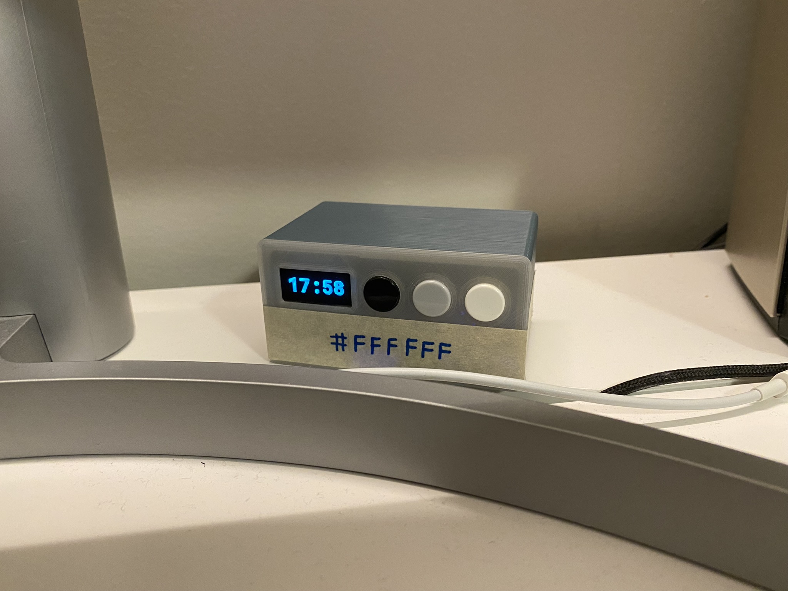
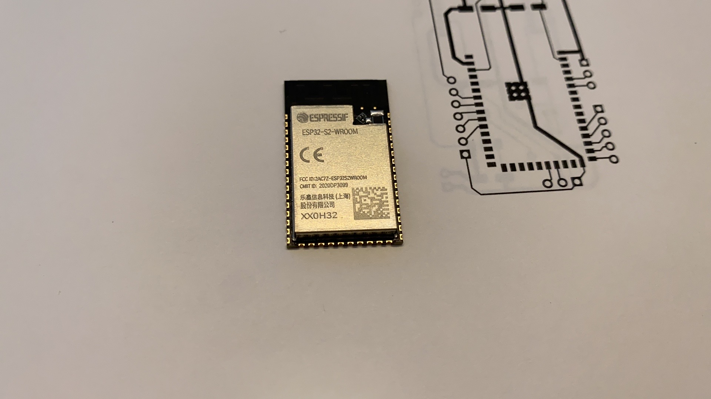
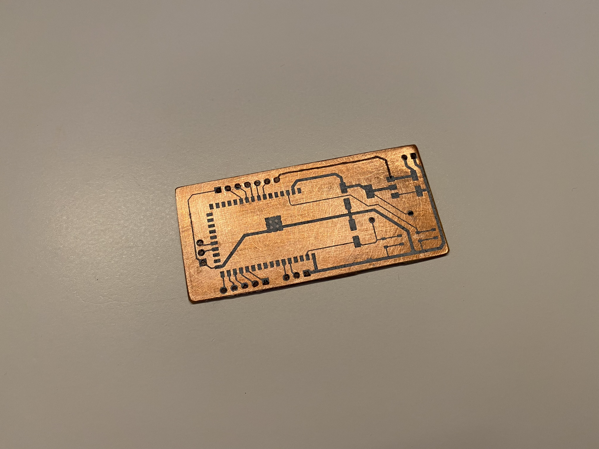
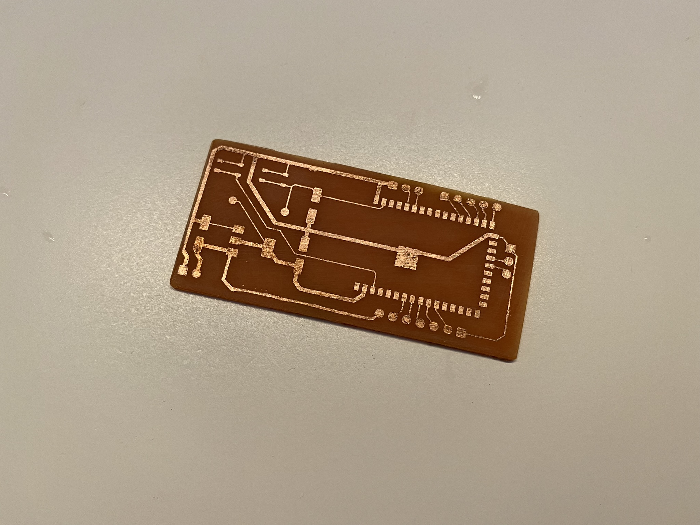
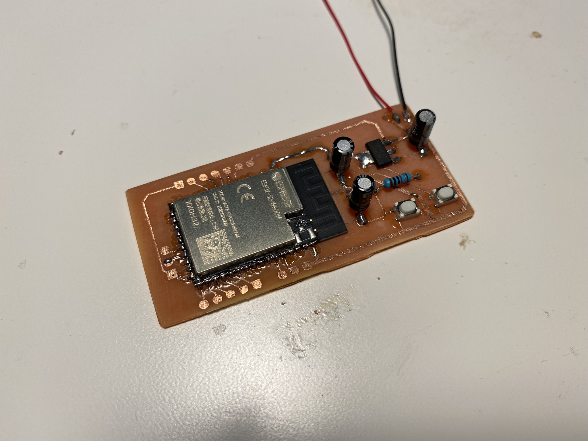
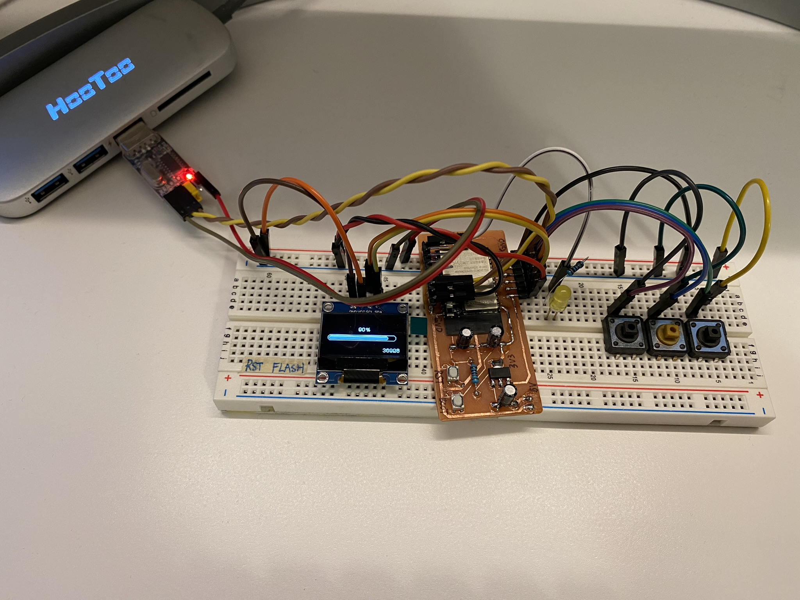
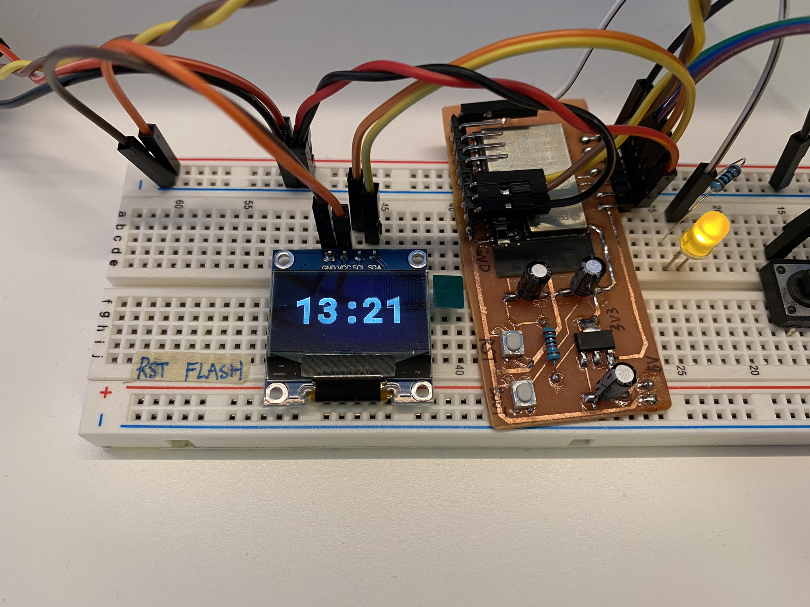
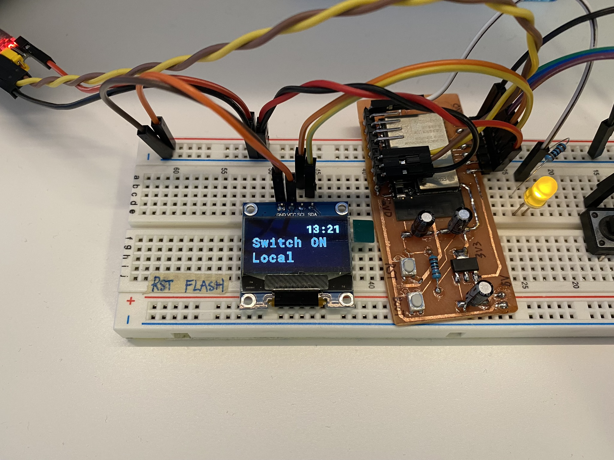
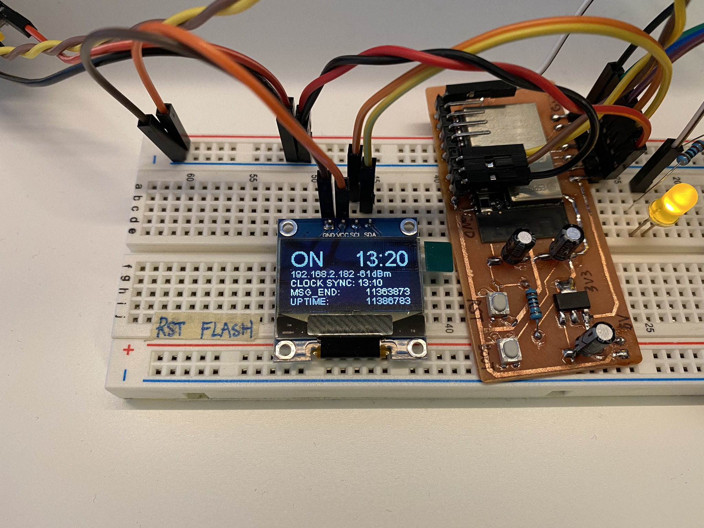

# ESP32_WiFi_Switch

This project include hardware design and firmware implementation for a ESP32-S2 powered network accessable on/off switch.



This switch have an 128*64 OLED I2C display to show information. User can turn on/off the switch from HomeKit, physical button, or web interface.

Powered by a [ESP32-S2-Wroom](https://www.espressif.com/sites/default/files/documentation/esp32-s2-wroom_esp32-s2-wroom-i_datasheet_en.pdf). Because the use of ESP32-S2 specific hardware timer library, firmware might have compatibility issue on older (or different) ESP32 models.

## Hardware



PCB printed | PCB etched
:-------------------------:|:-------------------------:
 | 

Soldered | Bread board
:-------------------------:|:-------------------------:
 | 

Single layer PCB designed with [KiCad](https://www.kicad.org/) in `./breakout_board`. This is only useful for starting with only a [module](https://www.espressif.com/en/products/modules), unnecessary if you already have a dev board. Requires ESP32-S2-WROOM library from [this](https://github.com/eggsampler/ESP32-S2-Breakout) breakout board design.

Connected devices includes:

* 3 buttons pull-down to ground (resistors are optional)

* 1 mono-color 128*64 OLED I2C display [like this one](https://www.adafruit.com/product/326) (These are like $2 - $3 each on Aliexpress)

* external circuit to drive a relay (or MOSFET) from a GPIO pin. (I use a transistor to drive a 5V relay)


## Firmware

Firmware was implemented in C++ using PlatformIO arduino framework. PlatformIO was initialized with [adafruit MagTag](https://www.adafruit.com/product/4800) configuration (which uses the same module), because ESP32-S2 Dev Board does not offer support for arduino framework.

Configure properties of firmware in `Firmware/src/config.h` according to how hardwares are connectred, and Wi-Fi credential. (ESP32-S2 allows any 2 GPIO pins to run I2C, connecting I2C display to any 2 GPIO pins should work)

### Functionalities

* [Automatically connect to Wi-Fi](https://randomnerdtutorials.com/esp32-useful-wi-fi-functions-arduino/) with credentials configured in `config.h`

* [Get current time from time server](https://randomnerdtutorials.com/esp32-date-time-ntp-client-server-arduino/)

* Sync time with time server periodically (uses [ESP32-S2 hardware timer](https://github.com/khoih-prog/ESP32TimerInterrupt/blob/master/examples/TimerInterruptTest/TimerInterruptTest.ino))

* [Turn on / off the switch from web interface](https://randomnerdtutorials.com/esp32-web-server-arduino-ide/)

* Turn on / off the switch with buttons, (white = on, gray = off)

* Press black button to cycle through display mode [REGULAR] -> [DEBUG] -> [OFF]

* Show message on screen when switch is being turn on / off, message stay on screen for 3000ms by default (configurable in `config.h`)

### Display

[REGULAR] mode:

* only shows current time

* display message in full screen if any.

[DEBUG] mode:

* on / off status of the switch

* current time

* Wi-Fi connection status, IP address and RSSI

* display message if any, otherwise show the time of last clock synchronization.

* time mark in ms for current message to hit it's 3000ms lifetime

* uptime in ms

REGULAR | REGULAR-MESSAGE| DEBUG
:-------------------------:|:-------------------------:|:-------------------------:
 |  | 


### PlatformIO Libraries

* [esp8266-oled-ssd1306](https://github.com/ThingPulse/esp8266-oled-ssd1306)

* [ESP32TimerInterrupt](https://github.com/khoih-prog/ESP32TimerInterrupt)

### HomeBridge Plugin

To make the switch accessable from [iOS Home](https://www.apple.com/ca/ios/home/), a separate [HomeBridge](https://homebridge.io/) server is required. I am running the HomeBridge server on a [RaspberryPi Zero W](https://www.raspberrypi.com/products/raspberry-pi-zero-w/).

Install this plugin: [homebridge-http-switch](https://github.com/Supereg/homebridge-http-switch#readme) in HomeBridge, change settings (fill in the ip address and name):

```
{
    "accessory": "HTTP-SWITCH",
    "name": "<name-display-in-Home>",
    "switchType": "stateful",
    "serialNumber": "<fill-in-anything-here>",
    "onUrl": "http://<ip-of-esp32>:80/homebridge/switch/on",
    "offUrl": "http://<ip-of-esp32>:80/homebridge/switch/off",
    "statusUrl": "http://<ip-of-esp32>:80/homebridge/switch/status"
}
```
